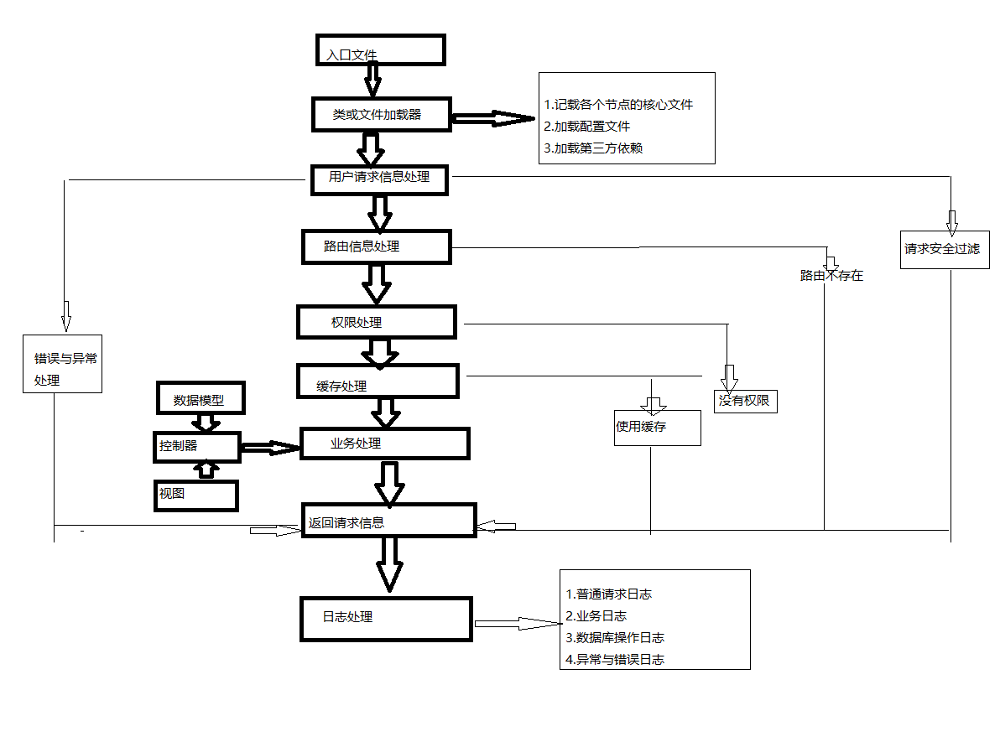

# wdf框架说明文档
目的
- 1、为了深入学习mvc思想
- 2、更深入的了解面向对象的设计模式以及实际应用
- 3、了解框架的运行原理

***
## 框架实现核心说明
- [一、单入口](#一、单入口)
- [二、框架的生命周期与目录结构设计](#二、框架的生命周期与目录结构设计)
- [三、类与文件的核心加载器](#三、类与文件的核心加载器)
- [四、用户请求数据的封装](#四、用户请求数据的封装)
- [五、路由处理](#五、路由处理)

框架名称命名：框架名称wdf为 Website Development Framework（网站开发框架）的缩写
***

## 一、单入口
***
定义：进入框架只允许有唯一的入口文件且有严格的生命周期
### 优点：
- 1、安全性高
- 2、可读性强
- 3、更规范，方便管理

### 实现：
- 1、强实现，使用域名重写urlRewrite模块来实现
- 2、软实现，入口文件我们使用面向过程的写法，框架其它的都采用面向对象的写法，要访问类中的方法，必须通过入口文件的调配

## 二、框架的生命周期与目录结构设计
***
### 框架的生命周期图

### 框架的目录结构
```
    ├── app
    │   ├── admin
    │   │   ├── crontroller
    │   │   ├── model
    │   │   └── view
    │   └── api
    ├── cache
    ├── log
    └── wdf
        ├── Cache
        ├── Log
        ├── config
        └── core
``` 

## 三、类与文件的核心加载器
***
 * 1、加载核心类
 * 2、加载配置文件
 * 3、记载控制器文件
 * 4、加载数据模型文件
 * 5、记载视图文件
 * 6、加载第三方依赖（composer）
 ### 核心加载处理类
 ```
<?php
    class Loader{
        //需要加载对象数组
        private static $_objlist=[];
        //标示的调用方法为静态
        const _STATIC=1;
        //标示的方法为对象的
        const _OBJECT=2;
        //标示方法为静态的
        const _SIGNLE=3;
        //配置文件信息
        private static $_config=[];
    
        /**
         * @desc 在对象前添加对象
         * @param $array
         */
        public static function unshiftObj($array){
            array_unshift(self::$_objlist,$array);
        }
    
        /***
         * @desc 监听对象个数用来遍历执行存储在数组的对象
         * @return bool
         */
        public static function listen(){
            if(count(self::$_objlist)>0){
                return true;
            }else{
                return false;
            }
        }
    
        /**
         * @desc 向对象末尾加入对象
         * @param $array
         */
        public static function pushObj($array){
            array_push(self::$_objlist,$array);
        }
    
        /**
         * @desc 加载类实现拦截
         * 保留返回信息和日志的记录
         */
        public  static function clear(){
            self::$_objlist = [];
            self::pushObj("Response");
            self::pushObj("Log");
        }
    
        /**
         * @desc 依次执行需要加载的对象
         */
        public static function doObj(){
            //取出数组中的第一组数据
            $objArr = array_shift(self::$_objlist);
            //获取类名
            $className = $objArr[0];
            //获取方法名称
            $funcNmae = $objArr[1];
            //获取参数信息
            $params = $objArr[2];
            //获取调用类型，是静态直接调用，还是对象调用方法，还是单例模式的方法调用
            $type = $objArr[3];
            //使用call_user_func_array方法调用类对应的方法
            if($type==self::_STATIC){
                call_user_func_array([$className,$funcNmae],$params);
            }elseif ($type==self::_OBJECT){
                $obj = new $className();
                call_user_func_array([$obj,$funcNmae],$params);
            }elseif ($type==self::_SIGNLE){
                $signleObj = $className::getInstance();
                call_user_func_array([$signleObj,$funcNmae],$params);
            }
        }
    
        /**
         * @desc 加载配置文件获取配置信息
         * @param $file
         * @param $key
         */
        public static function C($file,$key=null){
            if(isset(self::$_config[$file])){
                if(empty($key)){
                    return self::$_config[$file];
                }else{
                    //$key是数组的情况
                    if(is_array($key)){
                        $conf = self::$_config[$file];
                        foreach($key as $k=>$v){
                            $conf = $conf[$v];
                        }
                        return $conf;
                    }else{
                        return self::$_config[$file][$key];
                    }
                }
            }else{
                $info = include "./config.php";
                self::$_config[$file] = $info;
                return self::C($file,$key);
            }
        }
    
    }
    
    class A{
        public static function  init(){
            echo "A类型调用静态方法init成功<br/>";
        }
    }
    
    class B{
        public  function add($name,$age=null){
            echo "B类通过对象方法调用add方法成功,参数name:{$name} , age:{$age}<br/>";
        }
    }
    
    class C{
        private static $_instance;
    
        private function __construct()
        {
        }
    
        private function __clone()
        {
            // TODO: Implement __clone() method.
        }
    
        /**
         * @desc 获取实例化对象的入口
         */
        public static function getInstance(){
            if(!(self::$_instance instanceof C)){
                self::$_instance = new C();
            }
            return self::$_instance;
        }
    
        public function show(){
            echo " C类单例类调用show方法成功<br/>";
        }
    
    }
    
    /**
     * 使用unshiftObj，pushObj方法决定类执行的先后顺序，实现类的核心加载
     */
    Loader::unshiftObj(['A','init',[],Loader::_STATIC]);
    Loader::unshiftObj(['B','add',['思琼哈哈哈',33],Loader::_OBJECT]);
    Loader::pushObj(["C","show",[],Loader::_SIGNLE]);
    while (Loader::listen()){
        Loader::doObj();
    }
    
    //获取配置信息
    $dataInfo = Loader::C('config','database');
    print_r($dataInfo);
    echo "<br/>";
    $host = Loader::C('config',['database','host']);
    echo "host:".$host."<br/>";
```
### 运行结果
```
B类通过对象方法调用add方法成功,参数name:思琼哈哈哈 , age:33
A类型调用静态方法init成功
C类单例类调用show方法成功
Array ( [host] => localhost [user] => root [db] => test [password] => [port] => 3306 ) 
host:localhost
```
    
## 四、用户请求数据的封装
***

## 五、路由处理
***
- [1、响应式路由方案](#1、响应式路由方案)
- [2、配置式路由方案](#2、配置式路由方案)
- [3、注入式路由方案](#3、注入式路由方案)

### 1、响应式路由方案
四种响应式路由的展示方式
* 1./index.php?m=index&c=index&a=index
* 2./index.php?p=index-index-index
* 3./index.php/index-index-index
* 4./index.php/index/index/index
路由类Router.php
```
<?php
/**
 * @desc 核心路由类
 * Class Router
 */
class Router{
    //存储router类的实例
    private static $_router;
    //app应用名
    private $module;
    //模块名
    private $controller;
    //方法名
    private $action;

    /**
     * @desc 私有化防止外部new实例化
     * Router constructor.
     */
    private function __construct()
    {

    }

    /**
     * @desc 私有化克隆方法防止外部克隆
     */
    private function __clone()
    {
        // TODO: Implement __clone() method.
    }

    /**
     * @desc 唯一入口实例化router路由类
     * @return Router
     */
    public static function getInstance(){
        if(!(self::$_router instanceof Router)){
            self::$_router = new Router();
        }
        self::$_router->setRouter();
        return self::$_router;
    }

    /**
     * @desc 启用router
     */
    public function init(){
        //获取路由信息
        $this->setRouter();
    }

    /**
     * @desc 获取应用名
     * @return mixed
     */
    public static function getModule(){
        return self::$_router->module;
    }

    /**
     * @desc 获取控制器名称
     * @return mixed
     */
    public static function getController(){
        return self::$_router->controller;
    }

    /**
     * @desc 获取方法名称
     * @return mixed
     */
    public static function getAction(){
        return self::$_router->action;
    }

    /**
     * @desc 设置路由
     */
    private  function setRouter(){
        $this->module = isset($_GET['module'])?$_GET['module']:'api';
        $this->controller = isset($_GET['controller'])?$_GET['controller']:'user';
        $this->action = isset($_GET['action'])?$_GET['action']:'add';
    }


}

```

控制器核心类Controller.php
```
<?php
/**
 * @desc 核心的控制器处理类
 */
class Controller{

    /**
     * @desc 启动控制器
     */
    public function init(){
        $module = Router::getModule();
        $controller = Router::getController();
        $action = Router::getAction();
        $controller = ucfirst($controller).'Controller';
        include $controller.'.php';
        $class = '\\'.$controller;
        $c = new $class();
        $c->$action();
    }

}
```

业务处理类UserController.php
```
<?php

/**
 * @desc 用户管理控制器
 * Class UserController
 */
class UserController{

    /**
     * 添加用户
     */
    public function add(){
        echo "添加用户<br/>";
    }

    /**
     * @desc 删除用户
     */
    public function delete(){
        echo "删除用户<br/>";
    }

    /**
     * 修改用户
     */
    public function edit(){
        echo "修改用户<br/>";
    }

    /**
     * @desc 获取用户信息
     */
    public function show(){
        echo "获取用户信息<br/>";
    }

}
```
调试index.php
```
<?php
//调用路由类
include "Router.php";
//调用控制器类
include "Controller.php";

//实例化路由类，初始化路由
$router = Router::getInstance();
$router->init();
//调用控制类执行控制器的方法
$controller = new Controller();
$controller->init();
```

运行结果
```
执行：http://localhost/index.php
结果：添加用户

执行：http://localhost/index.php?module=api&controller=user&action=delete
结果：删除用户

执行：http://localhost/index.php?module=api&controller=user&action=edit
结果：修改用户

执行：http://localhost/index.php?module=api&controller=user&action=show
结果：获取用户信息

```


